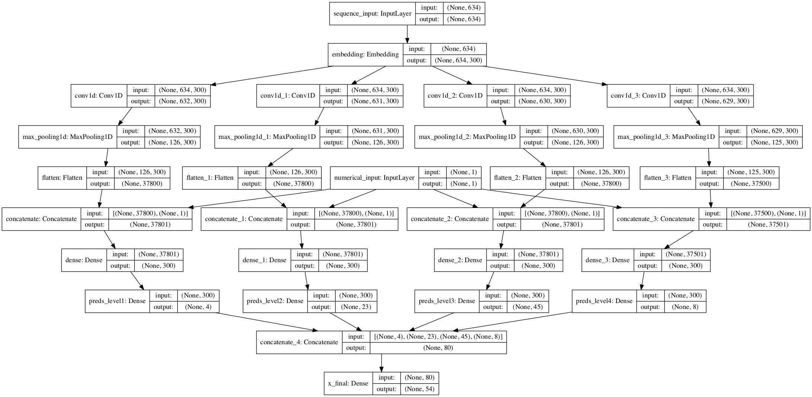

# Hierarchical text Classification CNN



This is multi-layered CNN for text classification with hierarchical classes.  
Classes structure:
``` 
[
    Consumer Electronics | Tablets & E-Books | Tablets,
    Consumer Electronics | Games, Consoles & Software | Game Consoles,
    Hobbies and Leisure | Bicycles | Parts and Accessories,
    Hobbies and leisure | Hunting and fishing,
    ...
]
```
The task was not only consider hierarchical structure of classes but also calculate accuracy on each level.  
Level of hierarchy varies from 2-4.    
Data was represented as title, description, price and category_id, where category_id is multi-labeled with "|" as separator.

Usage
=====
```
>>> cnn_model = CNNClassification(df,df1,df2)
>>> cnn_model.predict() # see main() to understand how to interpret results
```
TODO:
=====
* Extend from 4-level to n-level
* Try to use stopwords